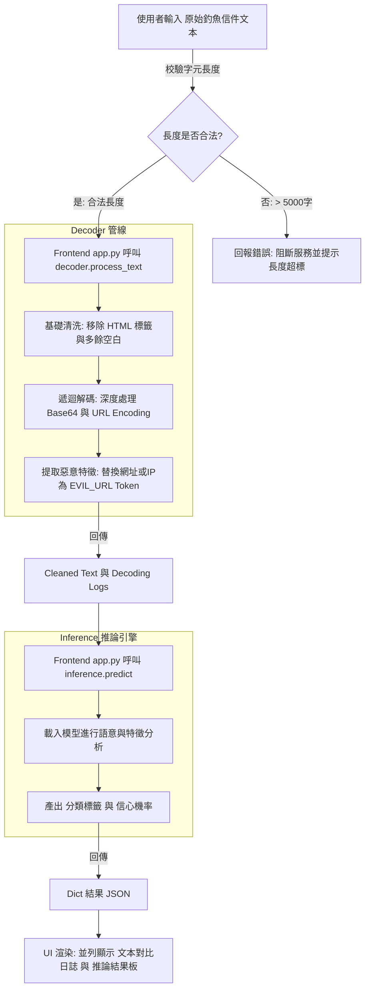

# 🥷 組員 C (系統整合與紅隊測試) - 開發計畫 (Planning)

## 🎯 本週目標與驗收標準
**目標**：完成前端介面與核心模組（解碼器、推論引擎）的整合，並進行初始連通性測試。
**🚀 本週驗收物**：可在 `localhost` 完整運作的網頁介面。

---

## 🔄 系統整合流程圖 (System Integration Flow)

---

## 📅 工作任務拆解

### [Task 1.7] 前端框架開發
* **檔案負責**：`app.py`
* **技術棧**：Streamlit
* **實作項目**：
  1. **輸入區塊**：提供使用者貼上待測電子郵件文本（Raw Email Text）的 Text Area。
     * *安全限制*：須實作字元長度校驗（例如 `len(payload) > 5000` 則阻擋並提示錯誤），防止 DoS 攻擊與伺服器過載。
  2. **分析按鈕**：觸發後端處理管線（Pipeline）的執行按鈕。
  3. **結果區塊 (Result Panel)**：
     * **AI 推論結果**：顯示分類標籤（`Phishing` / `Safe`）以及模型給出的信心機率（Probability）。
     * **解碼日誌 (Decoding Logs)**：以可視化方式並列顯示「原始文本」與「解碼後明文」，並詳細展示解碼器的每一步處置日誌（例如 `[Base64_Decode]` 處理紀錄），確保高度的系統透明度。

### [Task 1.8] 模組整合 (Module Integration)
* **依賴檔案**：`decoder.py`, `inference.py`, `app.py`
* **實作項目**：將前端 UI 與後端處理邏輯完全串接，並遵循架構規範。
  1. **串接 decoder.py**：
     * 前端接收文本後，呼叫 `process_text(payload)` 取得兩項回傳值：
       - `cleaned_text`（去除 HTML、遞迴解碼 URL/Base64、標準化空白後替換惡意 Token 的明文）
       - `decode_logs`（詳細的逐步處置日誌清單）
  2. **串接 inference.py**：
     * 將解碼清洗後的 `cleaned_text` 傳遞給 `predict(cleaned_text)`。
     * 取得分類結果字典（例如 `{"label": "Phishing", "probability": 0.985}`）。
  3. **例外與無效輸入處理**：
     * 於中介層處理 `None`, 空字串 `""` 等格式，若 `decoder.py` 回傳空值，則阻斷推論程序，直接在介面提示。

### [Task 1.9] 初始連通性測試與紅隊演練
* **檔案負責**：`test_payloads.txt`
* **實作項目**：
  1. **建構測試樣本**：準備 10 筆手工打造的釣魚與正常郵件樣本放入 `test_payloads.txt`。
  2. **樣本特徵須包含**：
     * 含有 URL Encoding (`%20`, `%3D` 等) 的混淆惡意連結。
     * 含有 Base64 隱藏惡意網址或文字的干擾文本。
     * 含有多餘 HTML 標籤（如 `<script>`, `<a>`）及大量空白字元的干擾樣本。
     * 長度異常大或極端邊界條件（Edge Cases）的測試字串。
  3. **端對端 (E2E) 介面驗證**：透過 Streamlit UI 逐一輸入這 10 筆樣本測試：
     * 驗證 `decoder.py` 的解碼日誌是否正確吐出並顯示在畫面上。
     * 驗證 `inference.py` 是否正常打分並回傳正確字典。
     * 確認過程無出現伺服器 Crashes 系統報錯。

---

## 🛠️ 執行步驟與時程安排建議
1. **[Day 1-2] 前端基底**：建立 `app.py` 基本版面（輸入框、按鈕、雙欄或上下 Layout 設定）。
2. **[Day 3] 邏輯橋接**：實作 `decoder.py` 與 `inference.py` 在 `app.py` 的引入與串接，完成資料流對接。
3. **[Day 4] 數據準備**：設計並蒐集 10 筆手工編織之對抗樣本，匯整至 `test_payloads.txt`。
4. **[Day 5] 整合測試**：啟動 `streamlit run app.py` 進行端到端 (End-to-End) 測試，修復 Bug、優化錯誤提示並確保達成「本週驗收物」標準。
