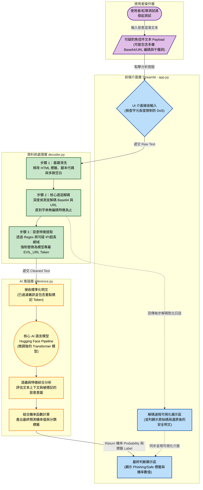

# AI 釣魚信件偵測系統 - 系統運作流程圖

這份流程圖展示了整個釣魚信件分析系統在終端使用者（或紅隊演練）操作時，資料是如何在系統各個模組之間流動與處理的。流程中的文字已優化，以清楚標示每個模組的具體處理細節。

### 系統運作步驟說明：
1. **輸入 (Input)**：使用者（或攻擊者）將一封包含各種混淆手法（例如 URL 編碼、Base64 隱藏惡意網址）的電子郵件貼入網頁介面，前端預先檢查字元限制防止 DoS 攻擊。
2. **前處理與解碼 (Decoding & Cleaning)**：系統將輸入交給 `decoder.py`。解碼器不僅會自動拔除 HTML 標籤，更透過「遞迴邏輯」持續探測並把 Base64 或 URL 編碼還原成明文。過程中，亦利用正則運算將可疑的惡意網址替換為專屬標籤 `[EVIL_URL]`。
3. **推論分析 (Inference)**：清理過後且特徵明顯的文字，接著被送入 `inference.py`。裡面的 AI 語言模型會讀取整段乾淨的文字與重點 Token 上下文，判斷隱含的釣魚意圖。
4. **結果呈現 (Output)**：最後，Streamlit 前端將會向使用者展示兩個核心資訊：
    - AI 所給出的**最終分類結果 (Phishing/Safe)** 與**信心機率**。
    - 系統在背景做解碼的**過程對比日誌**，包含每被還原一層的內容，讓使用者直接看穿編碼後的真實惡意 Payload。
