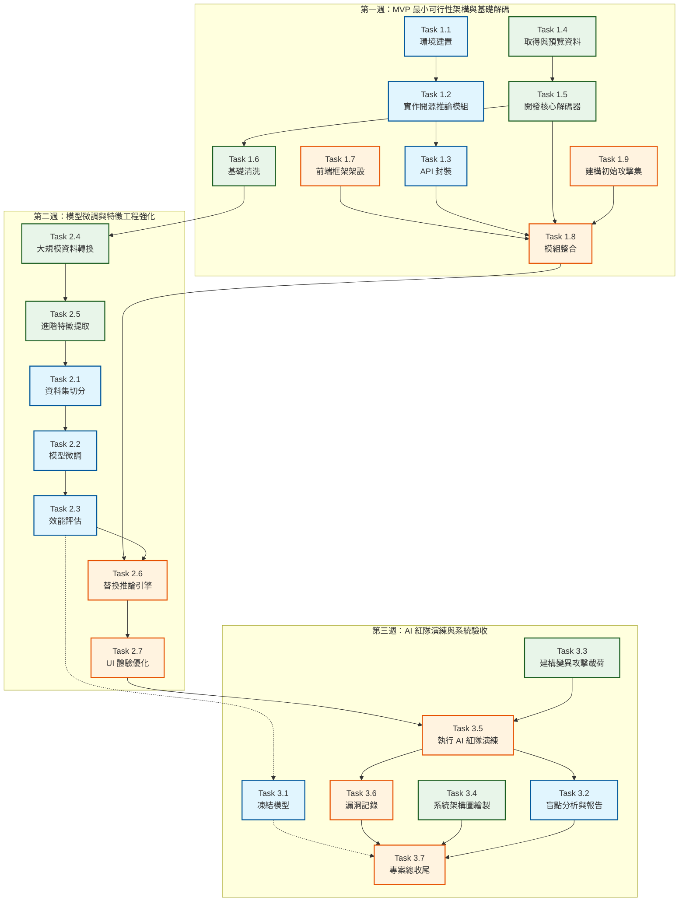

# AI 釣魚信件系統開發計畫流程圖

以下是根據 `planning.md` 所整理的開發流程圖，分為三個階段並以角色進行顏色標示，展現任務之間的前後相依與資料流動：

### 🧑‍💻 角色圖例說明：
- 🟦 **藍色節點**：組員 A (AI 工程師) 任務
- 🟩 **綠色節點**：組員 B (資安 / 資料工程師) 任務
- 🟧 **橘色節點**：組員 C (系統整合與紅隊測試) 任務
