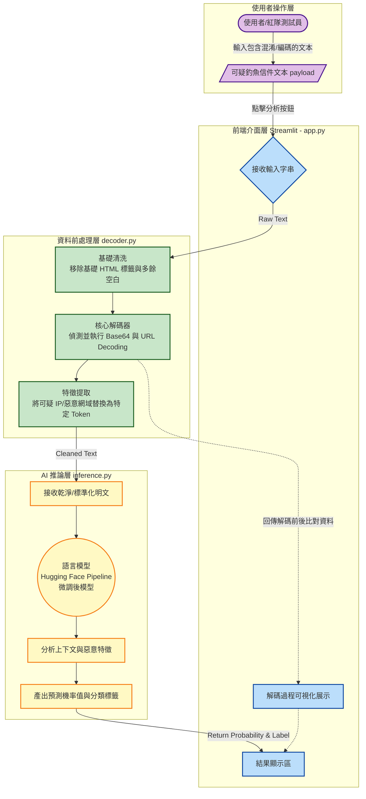

# AI 釣魚信件偵測系統 - 系統運作流程圖

這份流程圖展示了整個釣魚信件分析系統在終端使用者（或紅隊演練）操作時，資料是如何在系統各個模組之間流動與處理的。

### 系統運作步驟說明：
1. **輸入 (Input)**：使用者（或攻擊者）將一封包含各種混淆手法（例如 URL 編碼、Base64 隱藏惡意網址）的電子郵件貼入網頁介面。
2. **前處理與解碼 (Decoding & Cleaning)**：系統將輸入交給 `decoder.py`。解碼器會自動把 HTML 標籤拔除、把 Base64 或被編碼的 URL 還原成人類可讀的明文，並給予特殊標記（Token）。
3. **推論分析 (Inference)**：處理乾淨且特徵明顯的文字，接著被送入 `inference.py`。裡面的 AI 語言模型會讀取整段文字的上下文，判斷這是否為釣魚信件。
4. **結果呈現 (Output)**：最後，Streamlit 前端將會向使用者展示兩個核心資訊：
    - AI 給出的**分類結果**與**信心機率**。
    - 系統在背景做了解碼的**過程對比**（讓使用者知道背後藏了什麼惡意網址）。
